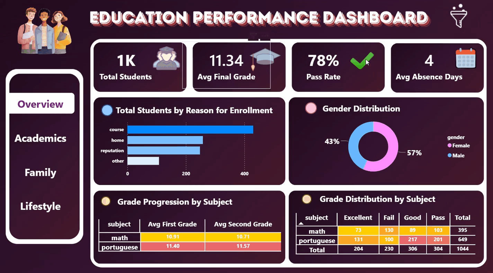
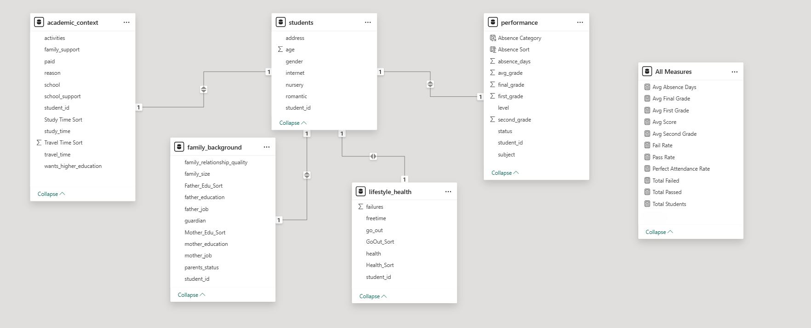
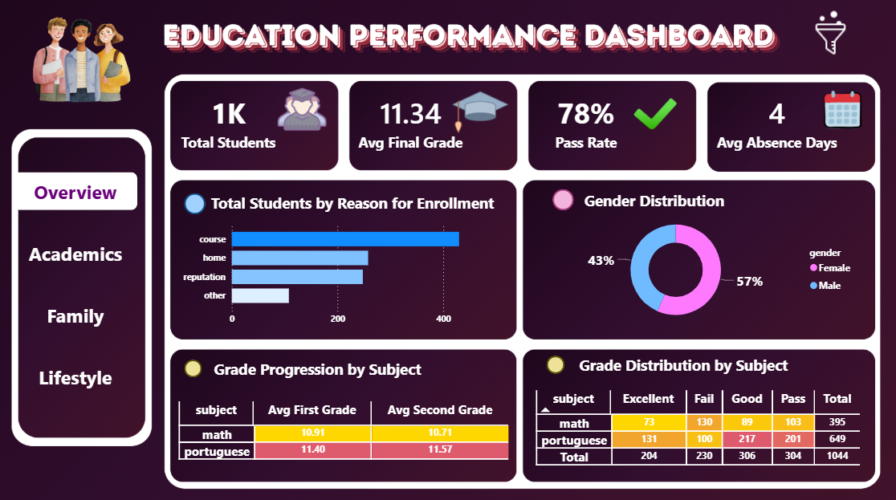
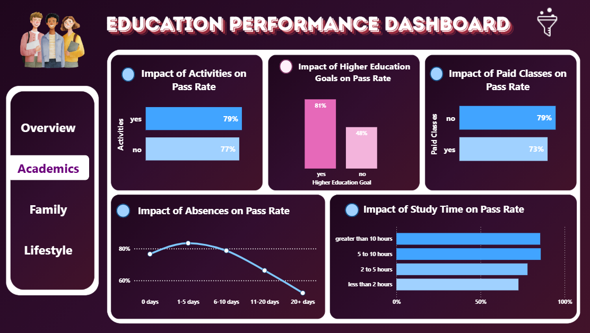
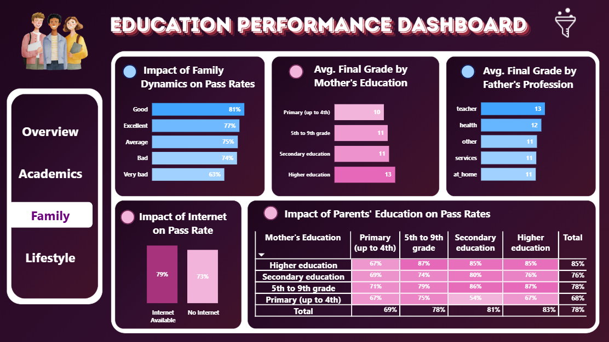
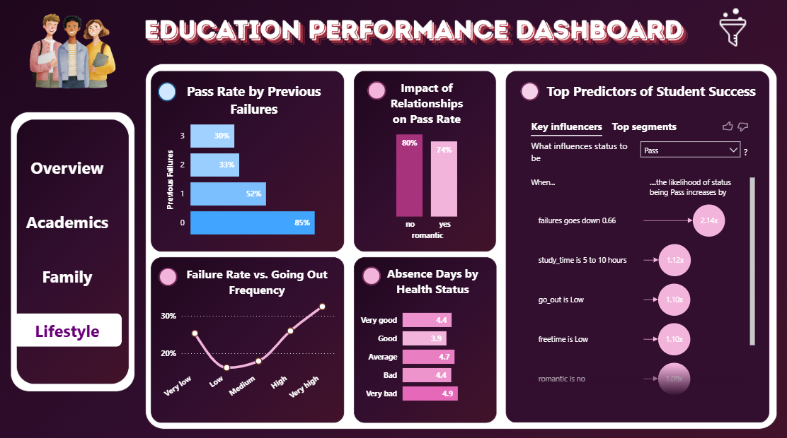

# 🎓 Education Performance Analytics <a id="readme-top"></a>

**An End-to-End Data Analytics & BI Project Uncovering the Hidden Drivers of Student Success**


<div align="center">
  
</div>


---

## 📑 Table of Contents

- [🎯 Project Mission](#project-mission)
- [📖 About the Project](#about-the-project)
- [🚀 Core Objectives](#core-objectives)
- [🛠️ Technologies & Tools Stack](#technologies--tools-stack)
- [📋 Dataset Overview](#dataset-overview)
- [🔍 Key Data Dimensions & Attributes](#key-data-dimensions--attributes)
- [🧹 Data Preparation & Cleaning](#data-preparation--cleaning)
- [🗄️ Data Modeling & SQL Architecture](#data-modeling--sql-architecture)
- [📊 Data Visualization & BI (Power BI)](#data-visualization--bi-power-bi)
- [💡 Key Insights & Findings](#key-insights--findings)
- [🎯 Strategic Conclusion & Actionable Recommendations](#strategic-conclusion--actionable-recommendations)
- [📂 Repository Structure](#repository-structure)
- [👥 Team Members](#team-members)

---

<a id="project-mission"></a>
## 🎯 Project Mission

The primary goal of this project is to decode the **key factors** that determine student academic success. By analyzing comprehensive data from **over 1,000 students** across core subjects (Math and Portuguese), we aim to move beyond traditional grading.

We explore how external factors, ranging from family dynamics, internet access, daily study hours, and social habits, directly impact **pass rates** and **final outcomes**.

Ultimately, this project provides a **data-driven overview** of student challenges, offering valuable insights that can help in understanding **performance gaps** and improving overall educational outcomes.

---

<a id="about-the-project"></a>
## 📖 About the Project

Student performance is rarely shaped by classroom activities alone; it is deeply intertwined with their socio-economic background, lifestyle choices, and personal ambitions. This project meticulously tracks these dimensions, categorizing them into three core analytical pillars: **Academics, Family, and Lifestyle**.

This repository documents a complete data analytics lifecycle. We transformed raw educational data into a robust relational model using **Python** and **Excel**. We then performed deep-dive statistical querying using **SQL**, and finally brought the insights to life through an interactive, multi-page **Power BI** dashboard equipped with AI-driven analytics (Key Influencers) to pinpoint the exact predictors of student success and failure.

---

<a id="core-objectives"></a>
## 🚀 Core Objectives

- **Performance Drivers:** Identify the primary factors influencing pass rates and final grades across different subjects and schools.
- **Behavioral & Lifestyle Impact:** Evaluate how attendance rates, study habits, romantic relationships, and free time directly correlate with academic outcomes.
- **Socio-Demographic Analysis:** Compare performance variations based on parents' education levels, father's profession, and family dynamics.
- **Data-Driven Decision Making:** Build a comprehensive BI dashboard to transform raw educational metrics into clear, actionable insights for better academic understanding and planning.

---

<a id="technologies--tools-stack"></a>
## 🛠️ Technologies & Tools Stack

- **Data Integration & Cleaning:** Python (Pandas) , Microsoft Excel , Power Query
- **Database & Querying:** PostgreSQL, Relational Database Modeling
- **Visualization & BI:** Microsoft Power BI
- **Version Control:** Git & GitHub

---

<a id="dataset-overview"></a>
## 📋 Dataset Overview

Before any cleaning or transformation, the project started with the raw dataset ([raw_data.xlsx](data/raw_data.xlsx)) containing comprehensive records of student attributes and performance metrics. 

- **Dataset Volume:** 1,044 student records (rows).
- **Features Count:** 34 analytical variables (columns).
- **Target Core Subjects:** Mathematics and Portuguese language courses.

---

<a id="key-data-dimensions--attributes"></a>
### 🔍 Key Data Dimensions & Attributes

The raw data is richly diversified and covers four main categories of features:

1. **Demographic Profiles:** Student's school, gender (`sex`), age, and address type (`Urban` vs. `Rural`).
2. **Family & Socio-Economic Background:** Parents' education levels (`Medu`, `Fedu`), professions (`Mjob`, `Fjob`), family size, and the quality of family relationships (`famrel`).
3. **Academic Context & Ambitions:** Current failures (`failures`), school support status, desire to pursue higher education (`higher`), and school absences.
4. **Lifestyle & Behavioral Habits:** Weekly/weekend alcohol consumption, free time, frequency of going out with friends (`goout`), current health status, and daily study hours (`studytime`).
5. **Grading Periods:** Performance metrics split across three periods: **G1** (First Grade), **G2** (Second Grade), and **G3** (Final Exam Score).

---

<a id="data-preparation--cleaning"></a>
## 🧹 Data Preparation & Cleaning

To ensure data integrity and optimize it for downstream modeling and BI tools, the raw data underwent a rigorous cleaning and transformation pipeline using **Python (Pandas)** (`data_cleaning_analysis.ipynb`), resulting in the final processed dataset ([cleaned_data.xlsx](data/cleaned_data.xlsx)).

**Core Transformation Steps:**

- **Data Integration:** Merged the separate Mathematics and Portuguese datasets into a unified dataframe, introducing a `subject` column to enable cross-subject analysis.
- **Feature Engineering:** Created derived features to streamline downstream dashboard reporting:
  - `avg_grade`: Calculated the mathematical mean of all three grading periods (G1, G2, G3).
  - `status`: Built a binary logic indicator (`Pass` if final grade ≥ 10, else `Fail`).
  - `level`: Segmented numerical scores into descriptive categorical performance tiers (`Excellent`, `Good`, `Pass`, `Fail`).
- **Data Standardization:** Renamed cryptic column headers for clarity (e.g., `Medu` to `mother_education`). Mapped numerical encoded values into descriptive, readable labels (e.g., converting study time levels and health status into clear text categories).
- **Noise Reduction:** Eliminated irrelevant features (e.g., `Walc`, `Dalc`) to strictly focus the analysis on academic, family, and core lifestyle dimensions.
- **Memory Optimization:** Converted standardized string variables into Pandas `category` data types, significantly reducing the memory footprint and accelerating query performance.

---

<a id="data-modeling--sql-architecture"></a>
## 🗄️ Data Modeling & SQL Architecture

To build a scalable foundation for Business Intelligence reporting, the cleaned dataset was imported into a relational database ([project.sql](sql/project.sql)) and transformed from a flat file into a robust relational model.

**Database Normalization Strategy:**

The master dataset was vertically partitioned into five normalized tables. They were interlinked via a central `student_id` using Primary and Foreign Key constraints to ensure referential integrity:

- **`students`:** Core demographic attributes (Age, Gender, Address, Internet Access).
- **`performance`:** Academic tracking metrics (First/Final Grades, Absences, Pass/Fail Status).
- **`academic_context`:** School-related factors (Study Time, Travel Time, Educational Support).
- **`family_background`:** Parental demographics and family dynamics (Education, Jobs, Family Size).
- **`lifestyle_health`:** Behavioral traits (Free Time, Going Out Frequency, Health Status).

**SQL Analysis & View Creation:**

Beyond structural modeling, analytical SQL queries were executed to uncover initial data patterns before visualization.

- **Analytical Queries:** Calculated key metrics including overall pass/fail rates, the academic impact of internet access and study time, and performance comparisons based on family education and school types.
- **Optimized Reporting:** Created a unified master SQL `VIEW` (`vw_student_full`) to denormalize the required fields specifically for Power BI, optimizing the data import process and dashboard performance.

---

<a id="data-visualization--bi-power-bi"></a>
## 📊 Data Visualization & BI (Power BI)

The final stage of the project transforms the validated database into actionable insights through interactive Power BI dashboards.

> 🚀 **[Explore the Live Power BI Dashboard](https://app.powerbi.com/view?r=eyJrIjoiM2VkODA3MGUtMDNmNy00ZDNlLTliYWYtNjZkMDZjYTQ5YTliIiwidCI6ImUzNmQ5N2M4LTVkMjgtNDM4Yi05YjEyLTQ5NzUwOGY2MGIyZiJ9)**


### 🗂️ Power BI Data Modeling (Schema)

Before building the visuals, a robust **Semantic Model** was constructed. The tables were imported from SQL and linked using strict **1-to-1 relationships** centered around the primary `students` table. Additionally, a dedicated **`All Measures`** table was created to centralize all **DAX (Data Analysis Expressions)** calculations, ensuring best practices for model performance and maintenance.


<p align="center">
  
</p>


### 🛠️ Advanced Interactive Features

To fully reflect the depth of the SQL analysis without cluttering the interface, several advanced BI techniques were implemented:

- **Context-Aware Slicers:** Instead of a generic filter panel, each dashboard page features a tailored set of slicers highly relevant to its specific theme, allowing for focused and logical drill-downs.
- **Visual-Specific Tooltips:** Every chart is equipped with customized tooltips designed specifically for its context. This reveals underlying secondary metrics on hover, keeping the main visuals clean while preserving analytical depth.


### 📌 1. Overview Dashboard (Executive Summary)

Displays a high-level summary of the dataset, tracking total students, overall pass/fail rates, and average grades across subjects.





### 🎓 2. Academics Dashboard (School Context)

Deep dives into academic-specific metrics, analyzing the impact of study time, previous failures, and school absences on final outcomes.





### 👨‍👩‍👧‍👦 3. Family Dashboard (Background Influence)

Examines how family background, including parental education, occupations, and family dynamics, influences students' academic performance.





### 🏃‍♂️ 4. Lifestyle Dashboard (Behavioral Impact)

Focuses on students' lifestyle choices, visualizing how free time, going out with friends, and health status affect academic performance.




---

<a id="key-insights--findings"></a>
## 💡 Key Insights & Findings

Based on the interactive data exploration and SQL analysis, several critical patterns regarding student performance emerged. Here are the key takeaways across different dimensions:

### 📊 1. Executive Summary Highlights

- **Overall Performance:** The analysis covers 1,044 students (57% female), achieving an overall pass rate of 78% with an average final grade of 11.34. The discipline rate is solid, with an average of only 4 absence days per student annually.
- **School Performance Variance:** Gabriel Pereira school demonstrated superior academic stability with a pass rate of 81%, outperforming Mousinho da Silveira (69%). This highlights the need to investigate differences in the educational environment or admission criteria.
- **Urban vs. Rural Dynamics & Gender Gap:** The Urban environment provides a more equitable and stable educational setting, boasting an average grade of 11.62 and identical pass rates for both genders (80%). Conversely, Rural areas experience a general decline in performance (average grade 10.60) along with a noticeable gender gap, where the male pass rate dropped to 69% compared to 76% for females.
- **Subject Bottlenecks:** Mathematics represents the most significant challenge for students, accounting for the highest failure rates (130 failed cases out of 395 students) and a slight decline in average grades between the first and second terms (from 10.91 to 10.71). In contrast, Portuguese shows remarkable stability and a high concentration of 'Good' and 'Excellent' evaluations.

### 🎓 2. Academic Performance Insights

- **The Power of Ambition:** Personal drive is the strongest predictor of success. Students aspiring to pursue higher education achieved a remarkable 81% pass rate, compared to a mere 48% for those without such goals.
- **The Paid Classes Paradox:** Overall, students taking paid classes show a lower pass rate (73%) compared to those who do not (79%). This overall drop is largely driven by the higher volume of students in language subjects (Portuguese), where struggling students tend to seek extra help, pulling the general average down. *(This becomes evident when toggling the Subject slicer).*
- **Optimal Study Time:** The highest pass rate (86%) is observed among students studying 5 to 10 hours weekly, slightly outperforming those studying over 10 hours (85%). This suggests that a balanced, high-quality study routine is more effective than sheer hours. Conversely, studying less than 2 hours drops the pass rate significantly to 73%.
- **The Cost of Absence:** The line chart reveals a clear threshold for absences. While missing 1-5 days maintains a stable pass rate (over 80%), crossing the 10-day mark causes a sharp and consistent decline, plummeting to near 50% for students with 20+ absences.
- **Extracurricular Activities:** Participation in activities shows a slight but positive impact on academic performance, yielding a 79% pass rate compared to 77% for non-participants, indicating that these activities do not distract from academic focus.
- **Commute Time & Fatigue:** Commute duration subtly impacts academic focus. Students with short commutes (less than 15 minutes) maintain a solid 79% pass rate. However, as commute time increases to the 30-60 minute range, the pass rate drops to 74%, highlighting the negative effects of daily travel fatigue.

### 👨‍👩‍👧‍👦 3. Family Background & Support

- **The Educational Inheritance:** The educational level of parents, particularly the Mother, shows a strong correlation with student performance. The dashboard clearly illustrates that students with mothers holding higher education degrees consistently perform better, scoring on average 2.33 points higher in their final grades compared to those whose mothers only have primary education (scoring 13 vs. 10).
- **The "Compound Effect" of Parents' Education:** The matrix reveals a powerful compound effect. When both parents hold higher education degrees, the pass rate reaches its peak at 85%. Conversely, if both parents have only primary education, the pass rate drops significantly to 67%.
- **Family Dynamics & Stability:** A healthy home environment is crucial. Students reporting a 'Good' or 'Excellent' family dynamic achieve pass rates of 81% and 77%, respectively. This plummets to 63% for students experiencing 'Very Bad' family relationships.
- **Family Size & Cohesion Status:** Family structure parameters showed a relatively minor impact compared to educational background. Students from smaller families performed slightly better (81% pass rate vs. 77% for larger families). Interestingly, parents' cohabitation status (Together vs. Apart) showed minimal variance, affecting overall scores by less than 3.5%.
- **The Digital Advantage:** Internet availability at home remains a solid advantage, correlating with a 79% pass rate, compared to a 73% pass rate for students lacking internet access.
- **The Guardian Effect:** The primary guardian's identity plays a pivotal role in student stability. Students whose primary guardian is the Father exhibit the highest pass rate at 83.1%, followed by the Mother at 77.4%. However, a critical risk factor emerges when the guardian is classified as 'Other' (neither parent), causing the pass rate to drop sharply to 65.7%, highlighting the vulnerability of students lacking direct parental supervision.
- **The "Family Support" Paradox:** Counterintuitively, toggling the Family Support slicer reveals that students receiving educational support at home do not achieve higher pass rates (77.8%) compared to those without it (78.2%). This paradox suggests that family academic support is largely reactive, with parents intervening and providing support primarily when the student is already struggling, rather than it acting as a proactive performance booster.

### 🏃 4. Lifestyle, Health & Social Habits Insights

- **The Weight of Past Failures:** Historical academic performance is a brutal predictor of current success. Students with zero previous failures boast a strong 85% pass rate. However, just a single past failure causes this rate to plummet to 52%.
- **The "Goldilocks" Zone of Socializing:** Moderate socializing is healthy ('Low' frequency correlates to the lowest failure rate at 16%). Conversely, excessive socializing is detrimental; students with 'Very High' going-out frequencies saw their failure rates double to 32.5%.
- **Free Time Management:** Unstructured free time negatively impacts performance. Students reporting 'Low' free time achieved the highest pass rates (84%), whereas those with 'Very High' free time dropped to 72%, underscoring the importance of a structured daily routine.
- **The Gender-Relationship Nuance:** While romantic involvement lowers scores overall, the impact is heavily skewed by gender. Male students in relationships face a drastic 9.5% drop in pass rates (from 79.6% down to 70.1%). In contrast, female students show more resilience, experiencing a milder 5.5% drop.
- **The Age-Performance Curve:** Academic success peaks at younger cohort ages (15-16 years old averaging an 83% pass rate). Performance steadily declines as students get older, dropping sharply to 59% by age 19, suggesting older students may require tailored support.
- **🤖 Top Predictors of Success (AI-Driven Segment):** Utilizing Power BI's Key Influencers AI visual, we identified the ultimate student profile that achieves a staggering 96.7% probability of passing: Zero previous failures, avoiding excessive socializing, maintaining good health, and remaining free from romantic distractions.

---

<a id="strategic-conclusion--actionable-recommendations"></a>
## 🎯 Strategic Conclusion & Actionable Recommendations

The overarching data narrative dictates that while a student's socioeconomic and family background establishes a foundational baseline, **personal behavioral factors remain the strongest and most actionable drivers of academic success.**

To practically improve student outcomes, educational institutions should focus on the following data-driven strategies:

1. **Implement Early Absence Alerts:** Since pass rates drastically decline after the 10-day absence threshold, schools should trigger intervention protocols when a student reaches 5 absences, preventing them from falling into the high-risk zone.
2. **Targeted Academic Support:** With a staggering 88% of students with prior failures continuing to struggle, historical performance must be used to assign immediate, targeted tutoring (especially in bottleneck subjects like Mathematics) at the beginning of the term.
3. **Promote the "Balanced Routine":** Rather than advocating for relentless studying, counselors should guide students toward the optimal "Goldilocks" zone: 5 to 10 hours of focused weekly study combined with a low-to-moderate social life. The AI predictive model identified this combination as the blueprint for a 96.7% pass probability.
4. **Shift to Proactive Family Engagement:** The data reveals that current "Family Support" at home is largely reactive (occurring after a student struggles). Schools must establish proactive parent-teacher communication early on. Furthermore, immediate mentorship programs must be provided for the highly vulnerable subset of students under non-parental guardianship ('Other'), whose pass rates drop sharply to 65.7%.
5. **Tailored Support for Older Cohorts:** Recognizing the significant age-performance curve, where pass rates decline steadily and drop sharply to 59% by age 19, institutions must realize that older students in the same grade levels require different pedagogical approaches and tailored psychological support to prevent dropouts.

---

<a id="repository-structure"></a>
## 📂 Repository Structure


```text
education-performance-analytics/
│
├── data/
│   ├── cleaned_data.xlsx
│   └── raw_data.xlsx
│
├── docs/
│   └── project_proposal.pdf
│
├── images/
│   ├── dashboard_demo.gif
│   └── data_model.png
│
├── powerbi/
│   ├── dashboard_screenshots/
│   │   ├── 01_Overview.png
│   │   ├── 01_Overview_Filters.png
│   │   ├── 02_Academics.png
│   │   ├── 02_Academics_Filters.png
│   │   ├── 03_Family.png
│   │   ├── 03_Family_Filters.png
│   │   ├── 04_Lifestyle.png
│   │   └── 04_Lifestyle_Filters.png
│   └── dashboard.pbix
│
├── python/
│   └── data_cleaning_analysis.ipynb
│
├── sql/
│   └── project.sql
│
└── README.md
```

---

<a id="team-members"></a>
## 👥 Team Members

| Name              | Role                        | Contact                                                                                                                                                                       |
| :---------------- | :-------------------------- | :---------------------------------------------------------------------------------------------------------------------------------------------------------------------------- |
| **Kamal Mohamed** | Data Preparation & Cleaning | [LinkedIn](https://www.linkedin.com/in/kamal-mohamed-9bb507250?utm_source=share_via&utm_content=profile&utm_medium=member_android) • [Email](mailto:kamal3.mohamed@gmail.com) |
| **Nawar Khaled**  | Data Modeling & Analysis    | [LinkedIn](https://www.linkedin.com/in/nawar-khaled-a52265221?utm_source=share_via&utm_content=profile&utm_medium=member_android) • [Email](mailto:nawar2004khaled@gmail.com) |
| **Eyad Adel**     | Data Visualization          | [LinkedIn](https://www.linkedin.com/in/eyad-adel-b040642a4) • [Email](mailto:eelsherbainy@gmail.com)                                                                          |

---

> 💡 **Thanks for checking out the project!**
> 
> Your support means a lot. Feel free to star ⭐ this repo or share it with anyone.

[⬆️ Back to Top](#readme-top)


